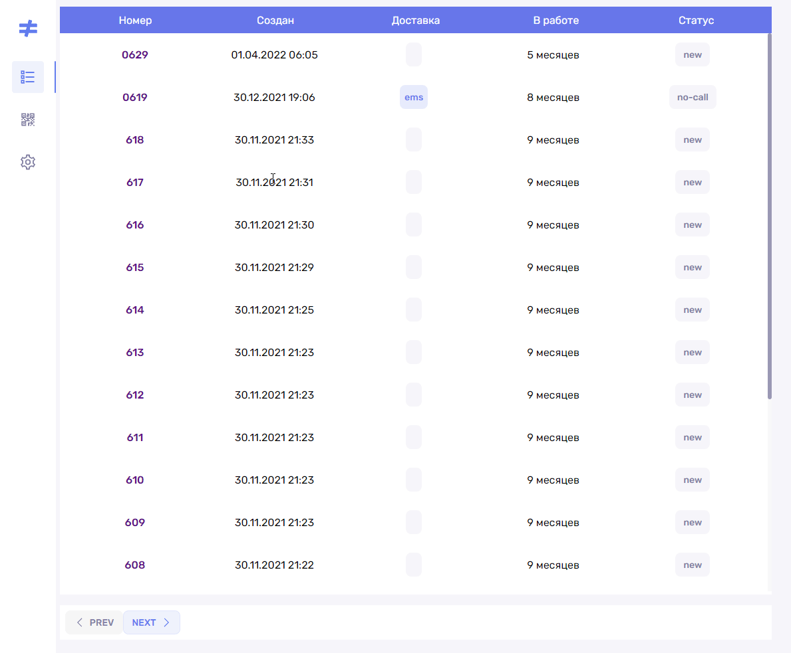

# FULLSTACK TEST CRM APP

## Technologies:
#### FE:
1) React
2) MobX
3) Stylus
4) CSS Modules
#### BE:
1) Nest.js
2) Typescript
3) GraphQL

## How to start App
BE listening port 3000 by default.
 
FE listening port 8080 by default.
  
Run:
1) clone repo: `git clone`
2) install deps:
- `npm i`
- `cd ./test-beckend`
- `npm i`
- `cd ./test-frontend`
- `npm i`
3) create .env files in BE (params: REACT_APP_RETAIL_KEY, REACT_APP_RETAIL_URL) and FE (params: PORT) folder.
4) go root and run script:
- `cd ./`
- `npm run-script fly`

## Demo Layout

